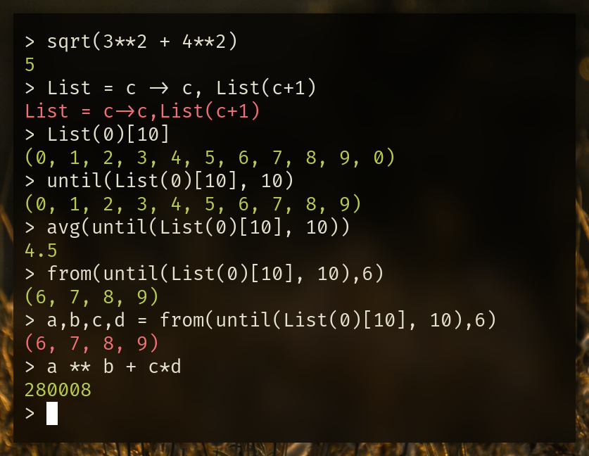

<h1 align="center">abacus</h1>
<p align="center">
Abacus is a simple interactive calculator CLI with support for variables, lambdas, comparison checks, and math functions
</p>
<p align="center">

</p>

```
λ abacus -h         

v1.2a

Usage: abacus [--no-color] [--precision PRECISION] [--eval EVAL]

Options:
  --no-color, -n         disable color in output [default: false]
  --precision PRECISION, -p PRECISION
                         precision for calculations [default: 64]
  --eval EVAL, -e EVAL   evaluate expression and quit
  --help, -h             display this help and exit
  --version              display version and exit

```

## Install

```
go get -u github.com/viktordanov/abacus
```

## Lambda expression support (experimental)
### Defining lambdas 
```
<LambdaName> = <arguments> -> <expression>   // or
<LambdaName> = (<arguments>) => <expression> // or
<LambdaName> = <arguments> -> <expression>, <expression>, ...
```

Both variables and lambda placeholders/aliases can be provided as arguments: 
```
Identity = x -> x
RunFnOnX = x, Fn -> Fn(x)
```

Note:
- Lambda names begin with a capital letter
- Parentheses around the arguments are optional, except when no variables are to be provided, e.g. `F = () -> 5+5`
- Lambdas can return multiple values - a tuple.
- Both `->` and `=>` can be used between the lambda variables and the expressions tuple.

#### Examples
```
Identity = x -> x
RunFnOnX = x, Fn -> Fn(x)
Area = a, b => a*b
Hypothenuse = (a,b) -> sqrt(a**2+b**2)
ToRad = deg -> deg * pi / 180
```

### Calling lambdas
```
<LambdaName>(<parameters>)
```
#### Examples
```
> Identity = x -> x
> Identity(2)
2
> Identity()
expected 1 parameter
> UndefinedLambda()
0
```
Note:
 - undefined lambdas return 0 by default like undefined variables 

### Arguments and recursion
Lambdas can use global variables and constants and will default to global variables if
a `variable` in the lambda expression isn't in the arguments tuple. The same applies to `lambda aliases`.
```
> Add = x, y -> (x + y) * not_found
> Add(5, 6)
0
> not_found = 1
> Add(5, 6)
11

> ApplyFn = x, Fn -> Fn(x)
> ApplyFn(12, Test)
0
> Test = x -> x*2
> ApplyFn(12, Test)
24
```

Lambdas can be recursive but only if explicitly told when called.
```
> Factorial = x -> x * Factorial(x - 1)
> Factorial(10)
recursion is disabled
```

To specify recursion parameters use `[]` after the lambda call. 

`F(value)[rec=10, last=x*10, stop=x < 5, mem: false]`
- `rec` — Expression (evaluated globally), *Default: 0*  
  * specifies the maximum number of times the lambda can call itself during the evaluation of the current expression;
- `last` — Expression (evaluated by the lambda), *Default: 0* 
  * specifies the expression which the last lambda automatically evalates when `rec` is reached or when `stop` is true;
- `stop` — BoolExpression (evaluated by the lambda)
  * a boolean expression which can use the lambda's variables; if true, the lambda returns `last` and stops recurring; 
- `mem` — BoolExpression (evaluated globally), *Default: false*
  * whether or not to utilize memoization for the current expression (useful when using recursion).

Either `=` or `:` may be used between the parameter name and the value.
```
> Factorial(10)[rec: 10]
0
> Factorial(10)[rec:10, last=1]
3628800 
> Factorial(10)[rec:10, last:1, stop: x == 5]
151200                                    
```
#### What exactly is happening?
If we define a new lambda `Count = x -> x,Count(x-1)` which returns a tuple we can observe how the value of x changes.

```
> Count(10)[rec:10]
(10, 9, 8, 7, 6, 5, 4, 3, 2, 1, 0)

> Count(10)[rec:10, last:100]
(10, 9, 8, 7, 6, 5, 4, 3, 2, 1, 100)

> Count(10)[rec:4, last:x*5]
(10, 9, 8, 7, 30)

>  Count(10)[rec:10, last:x, stop: x == 5]
(10, 9, 8, 7, 6, 5)
```

#### Advanced example with memoization and  `until`, `from`, `reverse`, and `nth`

```
> Fib = x -> Fib(x-1) + Fib(x-2)
> Map_ = value -> Fn(value), Map_(value-1)
> Map = value,length->Map_(value)[rec:length-1,last:Fn(value)]
> Fn = x -> Fib(x)[rec:1e6,last:1,stop:x<3]
> Map(10,10)
(55, 34, 21, 13, 8, 5, 3, 2, 1, 1)

> until(Map(10,10), 5)
(55, 34, 21, 13, 8)

> reverse(Map(10,10))
(1, 1, 2, 3, 5, 8, 13, 21, 34, 55)

> from(reverse(Map(10,10)), 1)
(1, 2, 3, 5, 8, 13, 21, 34, 55)

> from(reverse(Map(10,10)), 5)
(8, 13, 21, 34, 55)

> nth(from(reverse(Map(10,10)),5),2)
21


// If we attempted Map(20,10) it would take a while to compute because
Fib(20) branches out 2^n times.

> Map(20,10)
(6765, 4181, 2584, 1597, 987, 610, 377, 233, 144, 89)

// But due to the nature of the recursive Fibonacci algorithm, a lot
of the same function calls are made which means we can drammatically
speed up execution by caching computations.
> Fn = x -> Fib(x)[rec:1e6, last:1, stop:x<3, mem: true]
> Map(200,1)
280571172992510140037611932413038677189525

// Try it for yourself
```

## Features
- `History of expressions` and `Tab completion` of all math functions and defined variables
- All common operations
  ```
  > 1+1
  2
  > 1-20
  -19
  > 5^0 / 20
  0.05
  > 2**(2+5)
  128
  ```
- Variables
   ``` 
   > d = 12.5
   12.5
   > d * 5 + 5
   67.5
   > a * 5 + 5
   5
   ```
  **Note:** Undefined variables are equal to 0
- Comparisons `<, ==, >, <=, >=`
  ```
  > pi > phi
  true
  > 10 <=10
  true
  > 2 == 0
  false
  ```
- E, Pi, Phi
   ``` 
   > e
   2.7182818284590450907955982984276
   > pi
   3.1415926535897931159979634685442
   > phi
   1.6180339887498949025257388711907
   ```
- Single arity functions:
  - sqrt, cbrt, ln, log, log2, log10, floor, ceil, exp, sin, cos, tan, abs, round
- Two arity functions (accept 2-tuples):
    - round (number, digits of precision)
   ```
   > round(1.123456789,4)
  1.123
   ```
    - log (number, base)
   ```
   > log(16,4)
  2
- N-arity functions (accept n-tuples):
    - min, max, avg, from, until, reverse, nth
   ```
  > d, f = 10, 20
  (10, 20)
  > min(d, 4, -1, f, 0, 2)
  -1
  > max(d, 4, -1, f, 0, 2)
  20
  > avg(d, 4, -1, f, 0, 2)
  5.8333..
  
  > Map__ = value,Fn -> Fn(value), Map__(value+1, Fn)
  > List = start, len, Fn -> until(Map__(start, Fn)[rec: len], len)
  > I = x -> x
  > List(1, 5, I)
  (1, 2, 3, 4, 5)
   
  > from(List(1, 5, I), 2)
  (3, 4, 5)
  > until(List(1, 5, I), 2)
  (1, 2)
  > nth(List(1, 5, I), 2)
  3
  > reverse(List(1, 5, I))
  (5, 4, 3, 2, 1)
   ```

Note: `from(List(1, 5, I), 2)` is equivalent to `from(1,2,3,4,5,2)`
## Reserved names
 
 * `quit` – If a query includes quit, the program will terminate and the query will not be saved to the history file
 * The constants `e`, `pi`, and `phi`

# TODO

- [x] Add full feature list
- [ ] Write tests
  - [x] Base tests
  - [x] Simple benchmark of a complicated expression
  - [ ] Improve tests
- [ ] Refactor to depend less on other packages
- [ ] Implement most single arity functions with `*big.Float` for improved precision
